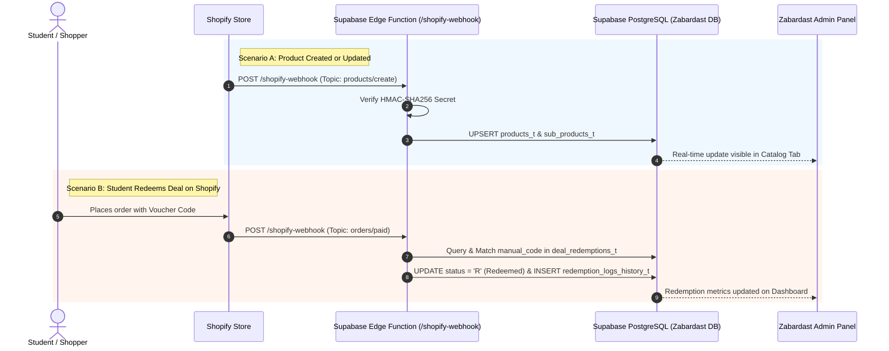

# Shopify Integration Guide: Direct Supabase Data Synchronization
**Project:** Zabardast Admin Panel & Rewards Platform  
**Target Backend:** Supabase (PostgreSQL, Auth, Edge Functions)  
**Date:** September 2026  
**Document Version:** 1.0.0

---

## 1. Executive Summary & Overview

The goal of this integration is to enable partner vendors on the **Zabardast Platform** to synchronize their e-commerce data directly between **Shopify** and the **Supabase database** powering the Zabardast Admin Panel.

### What This Integration Achieves:
1. **Catalog Auto-Sync**: Whenever a merchant creates or modifies a product or variant in Shopify, it is immediately inserted or updated in Zabardast's `products_t` and `sub_products_t` tables.
2. **Student Discount & Redemption Tracking**: When a verified student uses a Zabardast discount code or coupon at Shopify checkout, the completed order triggers an automatic redemption entry in `deal_redemptions_t` and logs savings into `redemption_logs_history_t`.
3. **Zero Extra Server Overhead**: By leveraging **Supabase Edge Functions** (Deno/TypeScript), synchronization occurs serverlessly with ultra-low latency, requiring no external Node.js hosting.

---

## 2. Architecture & Data Flow



---

## 3. Database Schema Migration

Run the following SQL migrations in your Supabase SQL Editor to prepare your existing tables for Shopify identifiers and webhook auditing:

```sql
-- ========================================================
-- STEP 1: Extend products_t with Shopify Identifiers
-- ========================================================
ALTER TABLE public.products_t 
ADD COLUMN IF NOT EXISTS shopify_product_id BIGINT UNIQUE,
ADD COLUMN IF NOT EXISTS shopify_handle VARCHAR(255),
ADD COLUMN IF NOT EXISTS sync_source VARCHAR(50) DEFAULT 'MANUAL';

CREATE INDEX IF NOT EXISTS idx_products_shopify_id ON public.products_t(shopify_product_id);

-- ========================================================
-- STEP 2: Extend sub_products_t for Product Variants
-- ========================================================
ALTER TABLE public.sub_products_t
ADD COLUMN IF NOT EXISTS shopify_variant_id BIGINT UNIQUE,
ADD COLUMN IF NOT EXISTS price DECIMAL(10, 2),
ADD COLUMN IF NOT EXISTS sku VARCHAR(100);

CREATE INDEX IF NOT EXISTS idx_sub_products_shopify_variant ON public.sub_products_t(shopify_variant_id);

-- ========================================================
-- STEP 3: Link deal_redemptions_t with Shopify Orders
-- ========================================================
ALTER TABLE public.deal_redemptions_t
ADD COLUMN IF NOT EXISTS shopify_order_id BIGINT,
ADD COLUMN IF NOT EXISTS shopify_order_number VARCHAR(100);

-- ========================================================
-- STEP 4: Create Shopify Integration Logs Table (Auditing)
-- ========================================================
CREATE TABLE IF NOT EXISTS public.shopify_webhook_logs_t (
    log_id BIGSERIAL PRIMARY KEY,
    vendor_id INT REFERENCES public.vendors_t(vendor_id) ON DELETE SET NULL,
    topic VARCHAR(100) NOT NULL,
    shopify_id BIGINT,
    payload JSONB,
    status VARCHAR(20) DEFAULT 'SUCCESS', -- 'SUCCESS' or 'FAILED'
    error_message TEXT,
    processed_at TIMESTAMPTZ DEFAULT NOW()
);

CREATE INDEX IF NOT EXISTS idx_shopify_logs_topic ON public.shopify_webhook_logs_t(topic, processed_at DESC);
```

---

## 4. Implementation Options

### Option A: Webhook + Supabase Edge Function *(Recommended)*
* **Architecture:** Shopify Webhooks $\rightarrow$ Supabase Edge Function $\rightarrow$ Database.
* **Pros:** Fastest to build (1–2 days), zero hosting costs, ultra-secure, automatic retry mechanism handled by Shopify.
* **Best For:** Direct background synchronization of products, inventory, and order redemptions.

### Option B: Custom Embedded Shopify App (Node.js / Remix / App Bridge)
* **Architecture:** Full app installed via Shopify App Store or custom distribution, rendering an iframe inside Shopify Admin.
* **Pros:** Provides merchant with a UI to input their Zabardast Vendor Token, test connection, and trigger manual "Sync Now" bulk operations.
* **Best For:** Self-service onboarding if you plan to launch on the official Shopify App Store.

---

## 5. Complete Supabase Edge Function Implementation

Create the file at `supabase/functions/shopify-webhook/index.ts`:

```typescript
import { serve } from "https://deno.land/std@0.177.0/http/server.ts";
import { createClient } from "https://esm.sh/@supabase/supabase-js@2.39.8";
import { crypto } from "https://deno.land/std@0.177.0/crypto/mod.ts";

// Environment variables configured in Supabase Secrets
const SHOPIFY_SHARED_SECRET = Deno.env.get("SHOPIFY_WEBHOOK_SECRET") || "";
const SUPABASE_URL = Deno.env.get("SUPABASE_URL") || "";
const SUPABASE_SERVICE_ROLE_KEY = Deno.env.get("SUPABASE_SERVICE_ROLE_KEY") || "";

// Supabase client with Service Role to bypass RLS securely on backend
const supabase = createClient(SUPABASE_URL, SUPABASE_SERVICE_ROLE_KEY);

/**
 * Validates HMAC SHA-256 signature generated by Shopify
 */
async function verifyShopifyHmac(rawBody: string, hmacHeader: string | null): Promise<boolean> {
  if (!hmacHeader || !SHOPIFY_SHARED_SECRET) return false;

  const encoder = new TextEncoder();
  const key = await crypto.subtle.importKey(
    "raw",
    encoder.encode(SHOPIFY_SHARED_SECRET),
    { name: "HMAC", hash: "SHA-256" },
    false,
    ["sign"]
  );

  const signature = await crypto.subtle.sign("HMAC", key, encoder.encode(rawBody));
  const base64Signature = btoa(String.fromCharCode(...new Uint8Array(signature)));

  return base64Signature === hmacHeader;
}

serve(async (req: Request) => {
  // Only accept POST requests
  if (req.method !== "POST") {
    return new Response(JSON.stringify({ error: "Method not allowed" }), { status: 405 });
  }

  try {
    const topic = req.headers.get("x-shopify-topic") || "";
    const shopDomain = req.headers.get("x-shopify-shop-domain") || "";
    const hmacHeader = req.headers.get("x-shopify-hmac-sha256");

    const rawBody = await req.text();

    // 1. Authenticate Request
    const isAuthentic = await verifyShopifyHmac(rawBody, hmacHeader);
    if (!isAuthentic) {
      console.warn(`[SECURITY] Invalid HMAC signature received from shop: ${shopDomain}`);
      return new Response(JSON.stringify({ error: "Unauthorized: Invalid HMAC signature" }), { status: 401 });
    }

    const payload = JSON.parse(rawBody);

    // 2. Extract vendor_id from Query Parameters (e.g., ?vendor_id=3)
    const url = new URL(req.url);
    const vendorIdParam = url.searchParams.get("vendor_id");
    const vendorId = vendorIdParam ? parseInt(vendorIdParam, 10) : null;

    if (!vendorId) {
      return new Response(JSON.stringify({ error: "Missing required query parameter: vendor_id" }), { status: 400 });
    }

    console.log(`[SHOPIFY SYNC] Topic: ${topic} | Vendor: ${vendorId} | Shop: ${shopDomain}`);

    // =========================================================================
    // TOPIC 1: products/create or products/update
    // =========================================================================
    if (topic === "products/create" || topic === "products/update") {
      const shopifyProductId = payload.id;
      const title = payload.title || "Untitled Product";
      const handle = payload.handle || "";
      const isActive = payload.status === "active";

      // Upsert into products_t
      const { data: productRow, error: productError } = await supabase
        .from("products_t")
        .upsert(
          {
            vendor_id: vendorId,
            product_name: title,
            shopify_product_id: shopifyProductId,
            shopify_handle: handle,
            is_active: isActive,
            sync_source: "SHOPIFY",
            update_date: new Date().toISOString()
          },
          { onConflict: "shopify_product_id" }
        )
        .select("product_id")
        .single();

      if (productError) {
        throw new Error(`Failed to upsert product: ${productError.message}`);
      }

      // Upsert Variants into sub_products_t
      if (Array.isArray(payload.variants)) {
        for (const variant of payload.variants) {
          const variantName = variant.title === "Default Title" ? title : `${title} - ${variant.title}`;

          await supabase.from("sub_products_t").upsert(
            {
              product_id: productRow.product_id,
              vendor_id: vendorId,
              sub_product_name: variantName,
              shopify_variant_id: variant.id,
              sku: variant.sku || null,
              price: parseFloat(variant.price || "0"),
              is_active: true,
              update_date: new Date().toISOString()
            },
            { onConflict: "shopify_variant_id" }
          );
        }
      }
    }

    // =========================================================================
    // TOPIC 2: products/delete
    // =========================================================================
    else if (topic === "products/delete") {
      const shopifyProductId = payload.id;
      await supabase
        .from("products_t")
        .update({ is_active: false, update_date: new Date().toISOString() })
        .eq("shopify_product_id", shopifyProductId);
    }

    // =========================================================================
    // TOPIC 3: orders/create or orders/paid (Deal Code Redemption)
    // =========================================================================
    else if (topic === "orders/create" || topic === "orders/paid") {
      const discountApplications = payload.discount_applications || [];
      const orderId = payload.id;
      const orderNumber = payload.name || `#${payload.order_number}`;

      for (const discount of discountApplications) {
        if (!discount.code) continue;
        const discountCode = discount.code.trim();

        // Check if this discount matches an active pending redemption in Zabardast
        const { data: redemption } = await supabase
          .from("deal_redemptions_t")
          .select("redemption_id, status, user_id, deal_id")
          .or(`manual_code.eq.${discountCode},qr_code_token.eq.${discountCode}`)
          .eq("status", "P") // Pending
          .maybeSingle();

        if (redemption) {
          // 1. Mark Deal as Redeemed
          await supabase
            .from("deal_redemptions_t")
            .update({
              status: "R",
              shopify_order_id: orderId,
              shopify_order_number: orderNumber
            })
            .eq("redemption_id", redemption.redemption_id);

          // 2. Insert into Historical Audit Log
          const savingsAmount = parseFloat(discount.value || "0");
          await supabase.from("redemption_logs_history_t").insert({
            redemption_id: redemption.redemption_id,
            verified_by_user_id: null, // System automated
            savings_amount: savingsAmount,
            notes: `Auto-redeemed via Shopify Order ${orderNumber} (${shopDomain})`
          });

          console.log(`[REDEMPTION SUCCESS] Redemption ID: ${redemption.redemption_id} matched Code: ${discountCode}`);
        }
      }
    }

    // Log success in audit table
    await supabase.from("shopify_webhook_logs_t").insert({
      vendor_id: vendorId,
      topic,
      shopify_id: payload.id || null,
      payload,
      status: "SUCCESS"
    });

    return new Response(JSON.stringify({ status: "success", message: "Processed successfully" }), {
      headers: { "Content-Type": "application/json" },
      status: 200
    });

  } catch (err: any) {
    console.error("[ERROR] Webhook failed:", err.message);
    return new Response(JSON.stringify({ status: "error", message: err.message }), {
      headers: { "Content-Type": "application/json" },
      status: 500
    });
  }
});
```

---

## 6. Deployment & Configuration Steps

### Step 1: Deploy Edge Function to Supabase
Run the following from your terminal:

```bash
# Deploy function
supabase functions deploy shopify-webhook --no-verify-jwt
```
> **Note:** `--no-verify-jwt` is mandatory because Shopify signs requests via HMAC in headers, not with a Supabase JWT bearer token.

### Step 2: Set Function Secrets in Supabase
Set your Shopify shared secret and Supabase service role key:

```bash
supabase secrets set SHOPIFY_WEBHOOK_SECRET="your_shopify_app_or_webhook_secret_here"
```

---

### Step 3: Configure Webhooks in Shopify Admin

1. Open the merchant's **Shopify Admin** console.
2. Go to **Settings** $\rightarrow$ **Notifications** (or **Settings** $\rightarrow$ **Webhooks**).
3. Click **Create Webhook**.
4. Configure the topics as follows:

| Event / Topic | Format | URL Destination | API Version |
| :--- | :--- | :--- | :--- |
| **Product creation** | `JSON` | `https://<PROJECT-REF>.supabase.co/functions/v1/shopify-webhook?vendor_id=VENDOR_ID` | `2024-04 (Latest)` |
| **Product update** | `JSON` | `https://<PROJECT-REF>.supabase.co/functions/v1/shopify-webhook?vendor_id=VENDOR_ID` | `2024-04 (Latest)` |
| **Product deletion** | `JSON` | `https://<PROJECT-REF>.supabase.co/functions/v1/shopify-webhook?vendor_id=VENDOR_ID` | `2024-04 (Latest)` |
| **Order creation** | `JSON` | `https://<PROJECT-REF>.supabase.co/functions/v1/shopify-webhook?vendor_id=VENDOR_ID` | `2024-04 (Latest)` |
| **Order payment** | `JSON` | `https://<PROJECT-REF>.supabase.co/functions/v1/shopify-webhook?vendor_id=VENDOR_ID` | `2024-04 (Latest)` |

*(Replace `VENDOR_ID` with the actual integer ID of the vendor in your `vendors_t` table).*

---

## 7. Security, Idempotency & Best Practices

1. **HMAC Signature Verification (Non-Negotiable)**:
   * Always verify `x-shopify-hmac-sha256`. Never process an unauthenticated incoming webhook.
2. **Never Expose Supabase Service-Role Key**:
   * Do not embed the service-role key in front-end Shopify theme assets (`theme.liquid` or storefront JavaScript). Keep all privileged writes inside the Edge Function.
3. **Idempotent Upserts (`ON CONFLICT`)**:
   * Shopify may deliver the same webhook more than once (e.g. on network retries).
   * By using `upsert` with `shopify_product_id` and `shopify_variant_id` unique constraints, duplicate entries are prevented automatically.
4. **Fast 200 OK Responses**:
   * Shopify expects a `200 OK` response within 5 seconds. Supabase Edge Functions respond in less than 200ms. If complex tasks (e.g., image downloading) are required later, offload them to background asynchronous tasks.

---

## 8. Summary Checklist

- [x] Run SQL migrations to add `shopify_product_id` and `shopify_variant_id` columns.
- [x] Deploy `shopify-webhook` edge function with `--no-verify-jwt`.
- [x] Configure `SHOPIFY_WEBHOOK_SECRET` in Supabase Secrets.
- [x] Add webhook endpoints inside Shopify Admin with the appropriate `?vendor_id=X` query string.
- [x] Verify live events by testing a product update or discount code order on Shopify.
