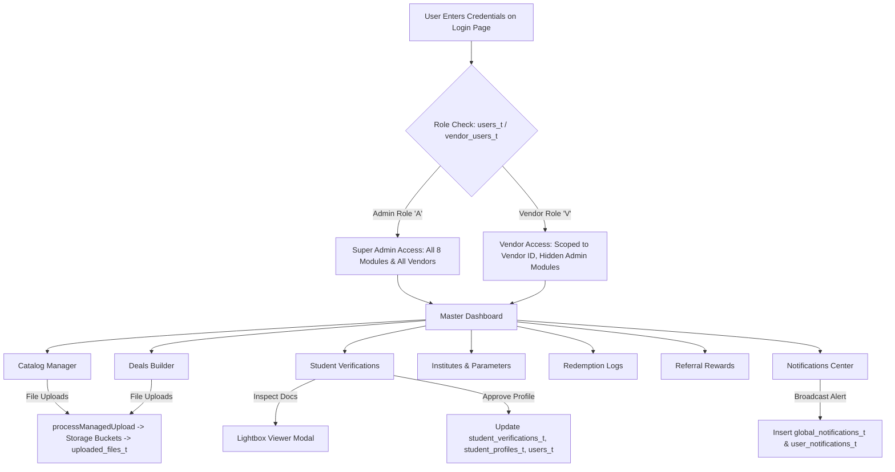

# Comprehensive Architecture & Technical Documentation
## Vanilla JS Application (`d:\Supabase`)

---

## 1. Overview & System Architecture

The Vanilla JS application (`d:\Supabase`) is a full-featured Admin & Vendor Management Portal for a student discount & rewards platform. It connects directly to a **Supabase (PostgreSQL + Auth + Storage)** backend via the `@supabase/supabase-js` client.

### Core Tech Stack:
- **Frontend Core**: Vanilla HTML5, CSS3 (CSS Custom Properties design system), Vanilla JavaScript (ES6+ async/await).
- **Backend Database**: Supabase (PostgreSQL with RLS, RPC functions, and Foreign Key relationships).
- **Storage**: Supabase Storage Buckets (`Vendor_Logos`, `categories`, `products`, `Student_Verification`).

---

## 2. Authentication & Role-Based Access Control (RBAC)

### Auth Implementation:
- **Files**: `login.html`, `login.js`, `common.js`
- **Session Duration**: 1 Hour (60 minutes) managed in `localStorage` via `supabase_admin_user` and `supabase_login_time`.
- **Session Guard**: `checkAuthAndSession()` runs on every page load to enforce 1-hour expiry and direct login redirects.

### User Roles & Permissions Matrix:

| Role Code | Role Name | System Scope | Accessible Modules & Permissions |
| :--- | :--- | :--- | :--- |
| **`A`** | **Super Admin** | Global (All Vendors & Institutes) | Full read/write access to all 8 portal modules: Dashboard, Catalog, Deals, Verifications, Institutes, General Parameters, Redemptions, Referrals, Notifications. Can select/switch any vendor filter. |
| **`V` / `A`** | **Vendor Admin** | Vendor Scoped (`scopedVendorId`) | Scoped exclusively to their assigned `vendor_id`. Locked out of Admin-only modules (Institutes, Parameters, Global Notifications). Access to own Catalog (Products, Sub-products, Branches, Vendor Staff Users), Deals, and Redemption History. |
| **`M`** | **Vendor Manager** | Branch Scoped | Access to branch products, deal redemptions, and staff logs for their assigned vendor. |
| **`S`** | **Vendor Supervisor** | Branch Scoped | Access to branch redemptions and cashier operations. |
| **`C`** | **Cashier / Staff** | Branch Scoped | Access to redemption scanning & code validation. |

---

## 3. Module-by-Module Technical & Functional Breakdown

---

### Module 1: Dashboard (`dashboard.html` & `dashboard.js`)

#### 🎨 UI Layout & Elements:
- **KPI Summary Cards**: Total Active Deals, Total Verified Students, Total Redemptions Count, Total Student Savings PKR.
- **Charts & Visual Graphs**: Real-time Redemption Trends Chart (Chart.js), Top Performing Vendors Bar Chart, Active Category Distribution Donut Chart.
- **Recent Activity Table**: Real-time log of the latest 10 deal redemptions.

#### ⚙️ Functions & Supabase Operations:
1. `fetchDashboardKPIs()`:
   - Queries `deals_t` where `is_active = true` for active deal counts.
   - Queries `student_profiles_t` where `is_verified = true` for verified student count.
   - Queries `redemption_logs_history_t` for total redemptions and sums `savings_amount`.
2. `renderRedemptionCharts()`:
   - Aggregates daily redemptions grouped by date and vendor name.

---

### Module 2: Catalog Manager (`catalog.html` & `catalog.js`)

The Catalog Manager controls the hierarchy of items: **Categories ➔ Vendors ➔ Branches ➔ Products ➔ Sub-Products ➔ Vendor Staff Users**.

#### 📁 Sub-Tabs & Forms Breakdown:

```
[ Categories Tab ] ──> [ Vendors Tab ] ──> [ Branches Tab ] ──> [ Products Tab ] ──> [ Sub-Products Tab ] ──> [ Vendor Users Tab ]
```

#### Form Fields, Validations & Supabase Save Operations:

##### A. Category Form:
- **UI Fields**: Category Name (`#f_cat_name`), Display Order (`#f_cat_order`), Category Image (`#f_cat_image`).
- **Validations**:
  - `Category Name` is required.
  - Image file type must be an image (`image/*`).
- **Supabase Save Handler (`saveCategory()`)**:
  1. Uploads image via `processManagedUpload()` to storage bucket `'categories'`.
  2. Inserts metadata into `uploaded_files_t` (`file_name`, `file_path`, `file_size_bytes`, `mime_type`) ➔ returns `file_id`.
  3. Inserts/Updates `categories_t`: `{ name, order_by, image_file_id, is_active: true }`.

##### B. Vendor Form:
- **UI Fields**: Category (`#f_ven_cat_id`), Vendor Name (`#f_ven_name`), Rating (`#f_ven_rating`), Vendor Logo (`#f_ven_logo`), Vendor Banner (`#f_ven_banner`).
- **Validations**:
  - Category and Vendor Name are required.
  - Vendor Admin lock: If Vendor user is logged in, Category is pre-locked to vendor's category.
- **Supabase Save Handler (`saveVendor()`)**:
  1. Uploads logo & banner via `processManagedUpload()` to storage bucket `'Vendor_Logos'`.
  2. Inserts into `uploaded_files_t` for `logo_file_id` & `banner_file_id`.
  3. Inserts/Updates `vendors_t`: `{ category_id, name, rating, logo_file_id, banner_file_id, is_active: true }`.

##### C. Branch Form:
- **UI Fields**: Vendor (`#f_br_ven_id`), Branch Name (`#f_br_name`), Location / Area (`#f_br_location`), Phone Number (`#f_br_phone`), City (`#f_br_city`), Address (`#f_br_address`).
- **Validations**:
  - Vendor and Branch Name are required.
- **Supabase Save Handler (`saveBranch()`)**:
  - Inserts/Updates `branches_t`: `{ vendor_id, branch_name, location, phone_number, city, address, is_active: true }`.

##### D. Product Form:
- **UI Fields**: Category (`#f_prod_cat_id`), Vendor (`#f_prod_ven_id`), Product Name (`#f_prod_name`), Product Code (`#f_prod_code`), Description (`#f_prod_desc`), Product Image (`#f_prod_image`).
- **Validations**:
  - Category, Vendor, and Product Name are required.
- **Supabase Save Handler (`saveProduct()`)**:
  1. Uploads image to storage bucket `'products'`.
  2. Inserts into `uploaded_files_t` ➔ `image_file_id`.
  3. Inserts/Updates `products_t`: `{ category_id, vendor_id, product_name, product_code, description, image_file_id, is_active: true }`.

##### E. Sub-Product Form:
- **UI Fields**: Product (`#f_sub_prod_id`), Sub-Product Name (`#f_sub_name`), Original Price (`#f_sub_orig_price`), Discount Price (`#f_sub_disc_price`), Description (`#f_sub_desc`), Image (`#f_sub_image`).
- **Validations**:
  - Parent Product and Sub-Product Name are required.
  - Original Price must be $\ge 0$.
- **Supabase Save Handler (`saveSubProduct()`)**:
  - Inserts/Updates `sub_products_t`: `{ product_id, sub_product_name, original_price, discount_price, description, image_file_id, is_active: true }`.

##### F. Vendor Staff Users Form:
- **UI Fields**: Vendor (`#f_usr_ven_id`), Branch (`#f_usr_br_id`), Full Name (`#f_usr_name`), Email (`#f_usr_email`), Password (`#f_usr_pass`), Vendor Role (`A` Admin, `M` Manager, `S` Supervisor, `C` Cashier).
- **Validations**: Email format required, Password required on create.
- **Supabase Save Handler (`saveVendorUser()`)**:
  - Inserts/Updates `vendor_users_t`: `{ vendor_id, branch_id, full_name, email, password_hash, vendor_role, is_active: true }`.

---

### Module 3: Deals Manager (`deals.html` & `deals.js`)

#### 🎨 UI Layout & Workspaces:
- **Tab 1: ➕ Create / Edit Deal**: Dynamic deal builder form with target chip selectors and banner image uploader.
- **Tab 2: 📋 View All Created Deals**: Interactive deal card grid with expand/collapse terms & branches, active status pills, and Edit/Deactivate triggers.

#### Form Fields & Validation Rules:
- `Category` & `Vendor`: Required.
- `Deal Title` & `Description`: Required. Auto-generates deal title based on discount parameters unless manually edited.
- `Discount Type`:
  - `P`: Percentage OFF (e.g. 50% OFF)
  - `F`: Flat PKR OFF (e.g. Flat Rs. 500 OFF)
  - `BG`: Buy 1 Get 1 Free
- `Discount Prefix`: `Flat` vs `Up To`.
- `Discount Value`: Required numeric input.
- `Target Scope`:
  - Target Educational Institutes (`deal_target_institutes_t`)
  - Target Vendor Branches (`deal_scope_t`)
  - Target Products (`deal_target_products_t`)
- `Validity Window`: `valid_from` date, `valid_until` date, `valid_day_from` (1-7), `valid_day_to` (1-7), `start_time`, `end_time`.
- `Banner Image`: Uploaded to `'Vendor_Logos'` bucket ➔ `uploaded_files_t` ➔ `deals_t.banner_image_id`.

#### ⚙️ Supabase Save Cascade (`saveDealRecord()`):
1. Uploads banner image file ➔ `uploaded_files_t.file_id` (`banner_image_id`).
2. Inserts/Updates `deals_t` record:
   ```javascript
   {
     category_id, vendor_id, title, description,
     discount_type, discount_prefix, discount_value,
     deal_tag, home_section, redeem_limit_per_day,
     valid_from, valid_until, valid_day_from, valid_day_to,
     start_time, end_time, min_purchase_amount, max_discount_amount,
     banner_image_id, is_active: true, created_by: 'Admin'
   }
   ```
3. Deletes existing and re-inserts junction records:
   - `deal_target_institutes_t` (`deal_id`, `institute_id`)
   - `deal_scope_t` (`deal_id`, `branch_id`)
   - `deal_fine_print_t` (`deal_id`, `instruction`, `order_by`)
   - `deal_target_products_t` (`deal_id`, `product_id`)

---

### Module 4: Student Verifications (`student_verifications.html` & `student_verifications.js`)

#### 🎨 UI Layout & Features:
- **KPI Bar**: `Total Student Profiles`, `Pending`, `Approved`, `Rejected`.
- **Status Tabs**: `All Profiles`, `⏳ Pending`, `✅ Approved`, `❌ Rejected`.
- **Student Profile Cards Grid**: Card per student with name, Student ID, Avatar initial, Email, Phone, Institute & Campus, Referral Code, Registered Date.
- **Verification Documents**: Student ID Card thumbnail and CNIC Front thumbnail with **Inspect** trigger opening a full-resolution Lightbox Viewer Modal.

#### ⚙️ Verification Approval & Rejection Logic:

```
[ User Clicks Accept & Verify ]
       │
       ├── 1. UPDATE student_verifications_t SET status = 'A', updated_by = 'Admin', update_date = now()
       ├── 2. UPDATE student_profiles_t SET is_verified = true, is_active = true WHERE user_id = target_user_id
       └── 3. UPDATE users_t SET is_active = true WHERE user_id = target_user_id
```

```
[ User Clicks Reject Profile ]
       │
       ├── 1. UPDATE student_verifications_t SET status = 'R', updated_by = 'Admin', update_date = now()
       ├── 2. UPDATE student_profiles_t SET is_verified = false, is_active = false WHERE user_id = target_user_id
       └── 3. UPDATE users_t SET is_active = false WHERE user_id = target_user_id
```

---

### Module 5: Institutes & Campuses (`admin_portal.html` & `admin_portal.js`)

#### 🎨 Master-Detail Layout:
- **Active Header Context Bar**: Shows selected institute context with a `Reset Selection Context` button.
- **Sub-Tabs**: `🏫 Institutes` (tab: `inst`) vs `🏢 Campuses` (tab: `camp`).
- **Left Panel**: Search bar, Institute filter dropdown, scrollable record item cards with active pills and soft delete trigger.
- **Right Panel**: Dynamic Create & Edit Form.

#### ⚙️ Data Model & Supabase Operations:
- **Institutes Table (`institutes_t`)**: `institute_id`, `name`, `is_active`, `created_date`, `created_by`, `updated_by`, `updated_date`.
- **Campuses Table (`institute_campuses_t`)**: `campus_id`, `institute_id`, `campus_name`, `city`, `address`, `order_by`, `is_active`.
- **Save Operations**: `.insert()` or `.update()` on submit; soft delete sets `is_active: false`.

---

### Module 6: General Parameters (`admin_portal.html` & `admin_portal.js`)

#### 🎨 Master-Detail Layout:
- **Active Header Context Bar**: Displays selected parameter header context with reset context trigger.
- **Sub-Tabs**: `⚙️ Parameter Headers` (tab: `hd`) vs `📋 Parameter Details` (tab: `dt`).
- **Left Panel**: Header filter dropdown, search input, scrollable list items with active pills and soft delete trigger.
- **Right Panel**: Dynamic Create & Edit Form.

#### ⚙️ Data Model & Supabase Operations:
- **Parameter Headers (`general_parameter_hd`)**: `header_id`, `description`, `order_by`, `is_active`.
- **Parameter Details (`general_parameter_dt`)**: `detail_id`, `header_id`, `detail_name`, `abbreviation`, `order_by`, `is_active`, `general_parameter_hd(description)`.
- **Save Operations**: `.insert()` or `.update()` on submit; soft delete sets `is_active: false`.

---

### Module 7: Redemption History (`redemption_history.html` & `redemption_history.js`)

#### 🎨 UI Layout & Features:
- **Scope Badge**: `👑 Admin View (All Vendors)` or `🟢 🏪 Vendor: Vendor Name`.
- **KPI Summary Cards**: `Total Redemptions`, `Total Student Savings PKR`, `Total Sales / Bill Value PKR`.
- **Filter Panel**: Search log, Branch filter dropdown, From Date, To Date, Filter & Reset buttons.
- **Redemption Logs Table**: Date & Time, Deal Details, Branch, Student Details, Processed By (Staff name & role badge), Voucher Code, Bill & Savings PKR.

#### ⚙️ Supabase Operations (`fetchRedemptionHistory()`):
1. Invokes Supabase RPC: `get_redemption_history({ p_vendor_id, p_branch_id, p_search_term, p_from_date, p_to_date, p_limit })`.
2. Fallback query on failure:
   Queries `redemption_logs_history_t` joining `deals_t`, `vendors_t`, `branches_t`, `student_profiles_t`, `vendor_users_t`, `deal_redemptions_t`.

---

### Module 8: Referral Rewards Program (`referral_rewards.html` & `referral_rewards.js`)

#### 🎨 UI Layout & Features:
- **Sub-Tabs**: `📊 Dashboard & Logs` vs `🏆 Reward Tiers Config`.
- **KPI Bar**: Total Invites Joined, Unlocked Rewards, Redeemed Rewards, Reward Tiers Count.
- **Reward Tiers Form**: Configures reward milestones (`required_referrals`, `vendor_id`, `deal_id`, `title`, `sub_text`, `is_active`).
- **Student Referral Logs Table**: Student Name, Phone, Vendor Name, Reward Title, Voucher Code Issued, Status (`🟢 READY` / `🔵 REDEEMED`).

#### ⚙️ Supabase Operations:
1. Queries `referral_reward_tiers_t` joining `vendors_t` and `deals_t`.
2. Invokes Supabase RPC: `fn_get_admin_student_referral_rewards_log({ p_status, p_search })`.
3. Fallback query joining `student_referral_rewards_t`, `student_profiles_t`, `users_t`.

---

### Module 9: Student Notifications Manager (`admin_notifications.html` & `admin_notifications.js`)

#### 🎨 UI Layout & Features:
- **Broadcast Modal**: Supports `🌐 Broadcast to ALL Students (Global)` vs `👤 Send to Specific Student`.
- **KPI Summary Widgets**: Total Sent Logs, Read Notifications, Unread Notifications, Target Students.
- **Filter Toolbar**: Search student, Notification Type dropdown (`SYS`, `ND`, `ED`, `W`, `V`, `R`, `RU`), Read Status (`Read` vs `Unread`), Date Sent.
- **Delivery Logs Table**: Student Details, Notification Type (Full Titles), Title & Body, Read Status (`Read` vs `Unread`), Date Sent.

#### ⚙️ Broadcast Dispatch Logic (`handleDispatchNotification()`):

```
[ Admin Submits Broadcast Form ]
              │
              ├── Target = ALL
              │      ├── 1. INSERT into global_notifications_t { title, body, notification_type, created_by, created_date }
              │      └── 2. INSERT into user_notifications_t for all active students { user_id, notification_type, title, body, is_read: false, created_date }
              │
              └── Target = SPECIFIC STUDENT
                     └── 1. INSERT into user_notifications_t { user_id, notification_type, title, body, is_read: false, created_date }
```

---

## 4. Summary Event Flow Diagram



---
*Documentation compiled for the Vanilla JS project codebase (`d:\Supabase`).*
